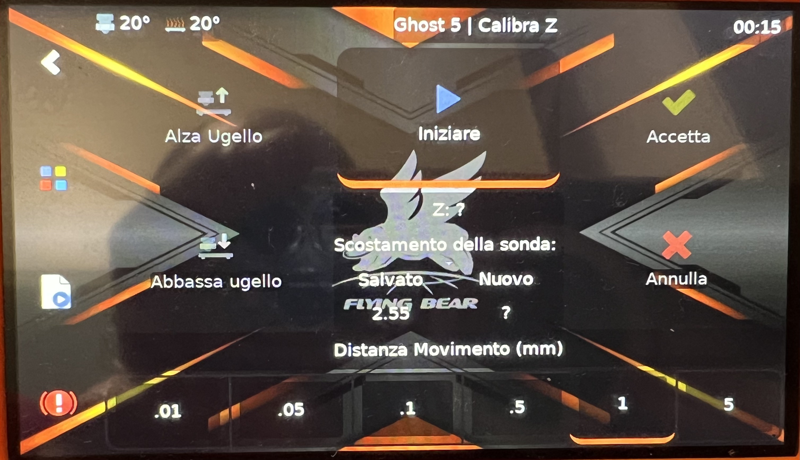

[**Opzione di installazione sulla testa di serie**](https://www.thingiverse.com/thing:5660302)

[**Possibilità di installazione sulla testa di serie avanzata**](https://www.thingiverse.com/thing:5744744)

La configurazione deve essere corretta per tenere conto della rientranza dall'ugello al punto di misurazione del bltouch!


**Questa configurazione è corretta per la versione della testa KARAS_4010 con estrusore BIQU H2 V2**

**Montaggio:**
si collega alla parte più bassa a sinistra della scheda, con la dicitura bl-touch, (segnale superiore, medio "+", terra inferiore) e al finecorsa "H" (è un sensore antincendio non necessario). I contatti del finecorsa (terra centrale, segnale superiore). 


**Impostazione:**
nella sezione [stepper_z] è necessario applicare delle correzioni! (per esempio endstop_pin: !PC8 cambiare in #endstop_pin: !PC8) 
Modificare le seguenti linee nel [printer.cfg]

```
#endstop_pin: !PC8 
endstop_pin: probe:z_virtual_endstop
#position_endstop: 0.5
```
(Attenzione: è possibile che nella configurazione sia già presente una sezione bed_mesh; cercarla e cancellarla, quindi inserire questa).

Crea una nuova sezione e scrivici dentro:

```
[bltouch]

sensor_pin: ^PC4
control_pin: PA8
y_offset: -17.85
z_offset: 2.0
x_offset: 22.65
speed: 10.0
samples: 2
samples_result: median
sample_retract_dist: 3.0
samples_tolerance: 0.1
samples_tolerance_retries: 1


[safe_z_home]
home_xy_position: 105,121                                                       # CAUTION! Depends on probe X/Y offset
z_hop: 10
move_to_previous: True                                                       # Return back ~X0/Y0 after Z0 at center
z_hop_speed: 10
speed: 50
[gcode_macro G29]
gcode:
    BED_MESH_CLEAR
    G28
    BED_MESH_CALIBRATE
    BED_MESH_PROFILE SAVE=name
    SAVE_CONFIG
    BED_MESH_PROFILE LOAD=name

[bed_mesh]
speed: 40
horizontal_move_z: 5 
mesh_min: 30,10 # CAUTION! = probe_xy = nozzle_xy + offset_xy
mesh_max: 245,185 # posizione tenendo conto dello spostamento sul bltouch
probe_count: 6,4 # qui mettiamo il numero di punti campione per X e per Y
algorithm: bicubic
fade_start: 1 #a quale altezza si inizia a livellare il modello
fade_end: 10 #a questa altezza in mm termineremo l'allineamento.

[screws_tilt_adjust] # = nozzle_xy = probe_xy - offset_xy
screw4: 5,30 
screw4_name: front left screw
screw1: 210,25
screw1_name: front right screw
screw2: 210,202 
screw2_name: back right screw
screw3: 5,202
screw3_name: back left screw
speed: 100
screw_thread: CW-M4
```

**Come controllare la distanza del sensore dall'ugello:** (PUNTO OBBLIGATORIO)
posizionare un foglio di carta sul piatto, fissarlo in modo stabile, allineando il bordo. spostare la testa sul foglio e segnare con una matita il punto in cui si trova l'ugello e la punta del sensore. Quindi rimuovere il foglio, misurare la distanza dall'ugello.

**Impostare Z-offset:**
Lanciare da console il comando [PROBE_CALIBRATE]
e seguire le istruzioni a monitor

Procedura tramite klippersreen:



Calibrazione del piatto:


**Regolare le viti del piatto tramite Bltouch:**
01:20 significa 1 giro completo e 20 minuti in senso orario CW = senso orario. CCW = antiorario. 

Очень удобная штука, винты настроить стало гораздо проще.

